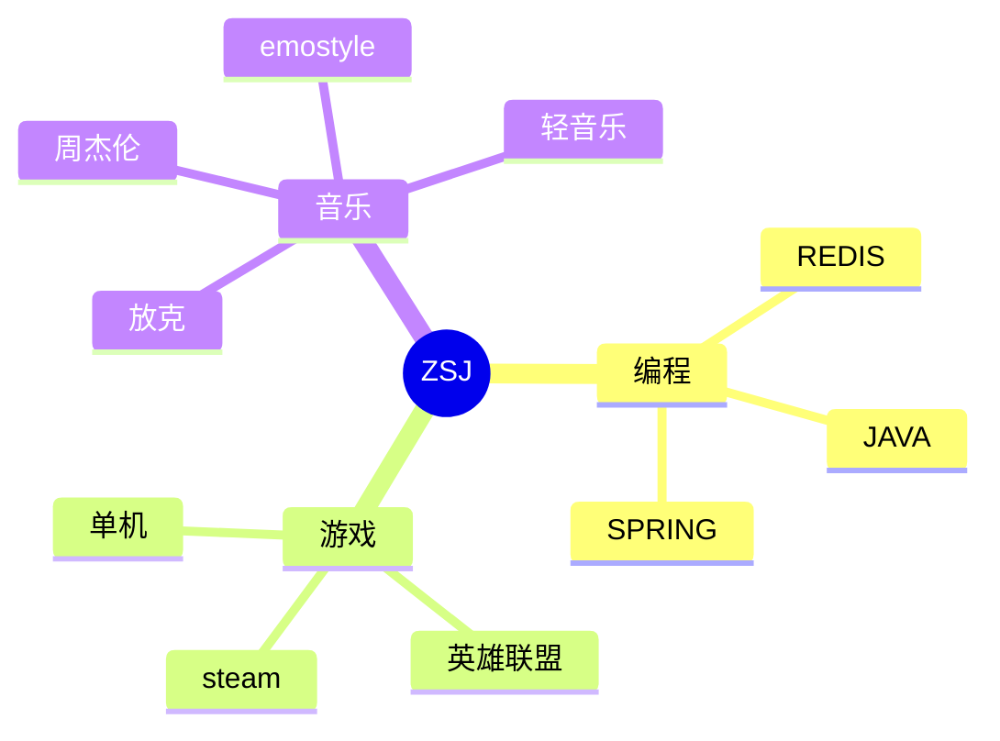

<div align="center">
  
  <!-- dynamic typing effect 动态打字效果 -->
  <div align="center">
<a href="https://git.io/typing-svg">
  
</a>
  </div>

  <!-- knock code pictures 敲代码的图片 -->
  <br>

  <!-- profile logo 个人资料徽标 -->
  <div align="center">
<!--     <a href="https://roozen.top/"></a>&emsp; -->
    <a href="https://space.bilibili.com/410276253"></a>&emsp;
    
  </div>

  <!-- Snake Code Contribution Map 贪吃蛇代码贡献图 -->
<picture>
  <source media="(prefers-color-scheme: dark)" srcset="https://cdn.jsdelivr.net/gh/Roozenlz/Roozenlz/profile-snake-contrib/github-contribution-grid-snake-dark.svg" />
  <source media="(prefers-color-scheme: light)" srcset="https://cdn.jsdelivr.net/gh/Roozenlz/Roozenlz/profile-snake-contrib/github-contribution-grid-snake.svg" />
  
</picture>

</div>

#  🙋 Hello

<table>
<tr><td>

<!-- About me 关于我 -->
### 🤺 About Me


<p>&emsp;&emsp;大家好，我是ZSJ。</p>
<p>&emsp;&emsp;热爱编程、音乐、游戏。</p>
<p>&emsp;&emsp;热爱软件工程和IT互联网事业，励志成为一名优秀的独立开发者。</p>
<p>&emsp;&emsp;我们正在让这个世界变得更加美好，通过代码的重复使用和延展构建完美体系。</p>
<p><strong>&emsp;&emsp;We're making the world a better place. Through constructing elegant hierarchies for maximum code reuse and extensibility.</strong></p>

<!-- wakatime 统计
### 📊 WakaTime

<picture>
  <source
    srcset="https://github-readme-stats.vercel.app/api/wakatime?username=zhengshengjun1125&layout=compact&text_color=f0f6fc&bg_color=00000000&hide_border=true&hide_title=true"
    media="(prefers-color-scheme: dark)"
  />
  <source
    srcset="https://github-readme-stats.vercel.app/api/wakatime?username=zhengshengjun1125&layout=compact&text_color=1f2328&bg_color=00000000&hide_border=true&hide_title=true"
    media="(prefers-color-scheme: light), (prefers-color-scheme: no-preference)"
  />
  
</picture>

</td></tr>

<tr><td>
 -->
<!--START_SECTION:waka-->
**I'm a Night 🦉** 

```text
🌞 Morning                274 commits         █████░░░░░░░░░░░░░░░░░░░░   19.45 % 
🌆 Daytime                422 commits         ███████░░░░░░░░░░░░░░░░░░   29.95 % 
🌃 Evening                505 commits         █████████░░░░░░░░░░░░░░░░   35.84 % 
🌙 Night                  208 commits         ████░░░░░░░░░░░░░░░░░░░░░   14.76 % 
```
📅 **I'm Most Productive on Friday** 

```text
Monday                   207 commits         ████░░░░░░░░░░░░░░░░░░░░░   14.69 % 
Tuesday                  187 commits         ███░░░░░░░░░░░░░░░░░░░░░░   13.27 % 
Wednesday                188 commits         ███░░░░░░░░░░░░░░░░░░░░░░   13.34 % 
Thursday                 150 commits         ███░░░░░░░░░░░░░░░░░░░░░░   10.65 % 
Friday                   353 commits         ██████░░░░░░░░░░░░░░░░░░░   25.05 % 
Saturday                 147 commits         ███░░░░░░░░░░░░░░░░░░░░░░   10.43 % 
Sunday                   177 commits         ███░░░░░░░░░░░░░░░░░░░░░░   12.56 % 
```


📊 **This Week I Spent My Time On** 

```text
🕑︎ Time Zone: Asia/Shanghai

💬 Programming Languages: 
Vue.js                   14 hrs 50 mins      ███████████████░░░░░░░░░░   59.52 % 
TypeScript               4 hrs 10 mins       ████░░░░░░░░░░░░░░░░░░░░░   16.76 % 
Markdown                 2 hrs 35 mins       ███░░░░░░░░░░░░░░░░░░░░░░   10.43 % 
HTML                     1 hr 28 mins        █░░░░░░░░░░░░░░░░░░░░░░░░   05.90 % 
JavaScript               53 mins             █░░░░░░░░░░░░░░░░░░░░░░░░   03.57 % 

🔥 Editors: 
VS Code                  24 hrs 55 mins      █████████████████████████   100.00 % 

💻 Operating System: 
Windows                  22 hrs 39 mins      ███████████████████████░░   90.91 % 
Mac                      2 hrs 15 mins       ██░░░░░░░░░░░░░░░░░░░░░░░   09.09 % 
```

<!--END_SECTION:waka-->
</td></tr>
</table>
<!-- ########################################## 分割 ########################################## -->

<div align="center" >



<!-- programming tool icon 编程工具图标 -->
<br>

<!-- svg -->


 


<br>

<!-- gif -->


<!-- just img 图片 -->
</div>

<!-- profile-3d-contrib 3D贡献图-->

</div>

<!-- ########################################## 分割 ########################################## -->


<div align="center" >

<!-- Github-Stats-Terminal 终端风格信息 -->
<br>
  
<!-- Quotes 名人名言 -->
<br>
  
<!-- GitHub 奖杯🏆 -->
<br>

<!-- GitHub 数据统计 -->

<br><br>

<!-- Awesome repo 比较好的仓库-->
<a href="https://githubfast.com/Roozenlz/Awesome-Love-Code">
</a>
<a href="https://githubfast.com/Roozenlz/Student-Data-Vision">
</a><br><br>
  
<!-- Wakatime Graph-->
<table>
  <tr>
    <td></td>
    <td></td>
  </tr>
  <tr>
    <td colspan="2"><a href="https://run.sunguoqi.com"></a><br></td>
  </tr>
</table>
</div>

<!-- ########################################## 分割 ########################################## -->


<div align="center">

<!-- run 图片 -->


<!-- Joke 笑话 -->
<div></div>

<!-- github-readme-streak-stats 连续提交代码天数记录 -->
&emsp;

&emsp;

<!-- GitHub Activity Graph GitHub 活动图 -->
<table align="center">
  <tr>
    <td></td>
  </tr>
</table>

</div>

<!-- ########################################## 分割 ########################################## -->


<!-- GitHub metrics 信息指标 -->
<div align="center">

<!-- just img 图片 -->


<!-- just img 图片 -->

</div>
</div>


